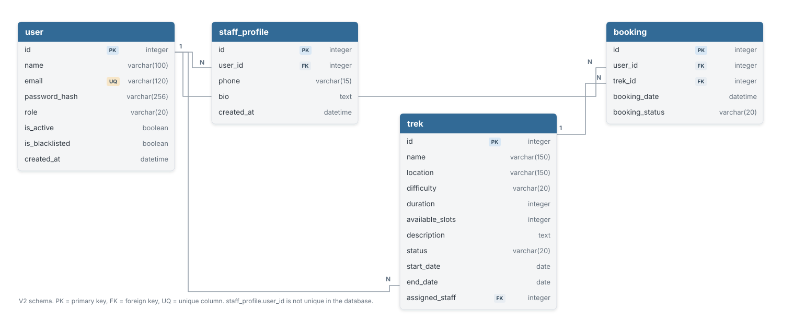

# Trekking Management Application — V2

A role-based trekking management application built with **Flask, SQLAlchemy, SQLite, Vue.js 3, and Bootstrap 5**.

V2 separates the Flask backend API from the Vue single-page frontend and demonstrates authentication, role-based workflows, trekking operations, and booking management.

## Highlights

- Flask backend with SQLAlchemy ORM
- Vue 3 frontend with Vue Router and Axios
- JWT-based authentication
- Role-based admin, staff, and trekker workflows
- Trek management and staff assignment
- Booking and status tracking
- Relational database design

## Tech stack

| Layer | Technology |
|---|---|
| Backend | Python, Flask, Flask-SQLAlchemy |
| Database | SQLite |
| Authentication | Flask-JWT-Extended |
| Frontend | Vue.js 3, Vite, Vue Router, Axios |
| UI | Bootstrap 5 |
| Background jobs/cache | Celery and Redis (project components) |

## Entity-Relationship Diagram

The diagram below reflects the current V2 SQLAlchemy models. The editable DBML source is available at [`docs/er-diagram.dbml`](docs/er-diagram.dbml).



## Project structure

```text
backend/    Flask API, models, and server configuration
frontend/   Vue.js single-page application
docs/
├── er-diagram.dbml
└── images/
    └── er-diagram.svg
```

## Run locally

### Backend

```bash
cd backend
python -m venv .venv
```

Activate the virtual environment, then install and run:

```bash
pip install -r requirements.txt
python app.py
```

### Frontend

```bash
cd frontend
npm install
npm run dev
```

Follow the backend/frontend environment configuration in the source before running. Do not use default or shared credentials outside a disposable local environment.

## Notes

This is a supporting academic application project, documented to make its architecture and database relationships easier to inspect. It is not presented as a production-ready service.

---
**Author:** Vihaan Bhambhani
